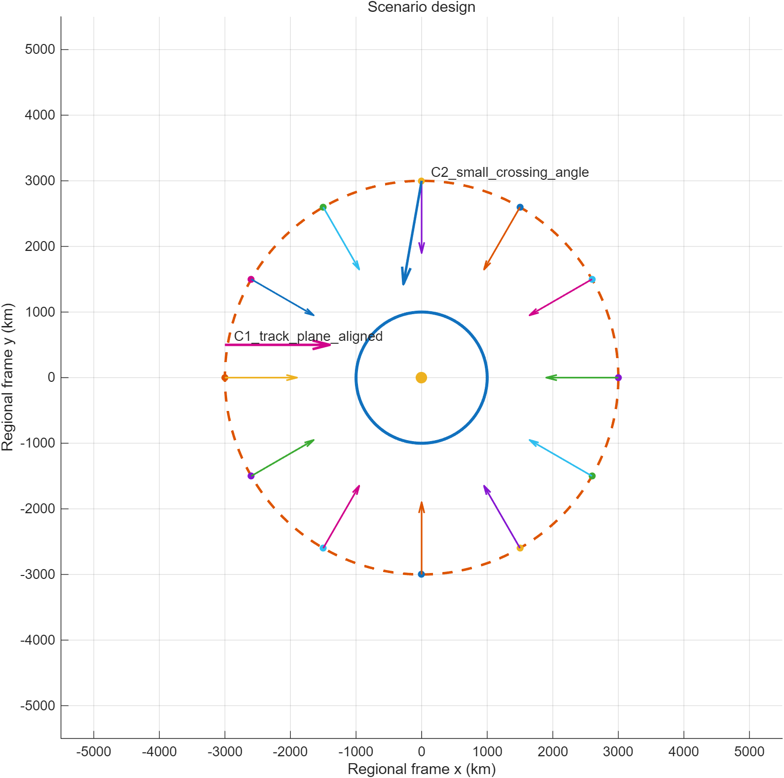
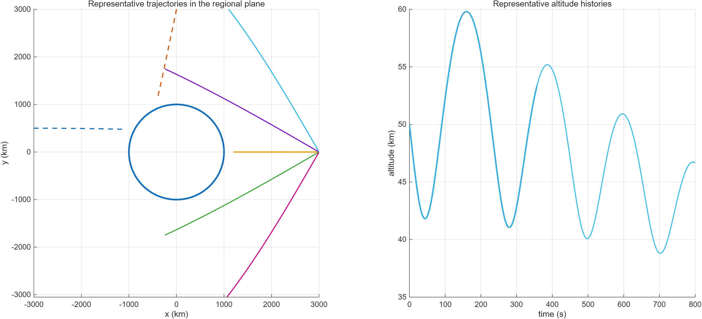
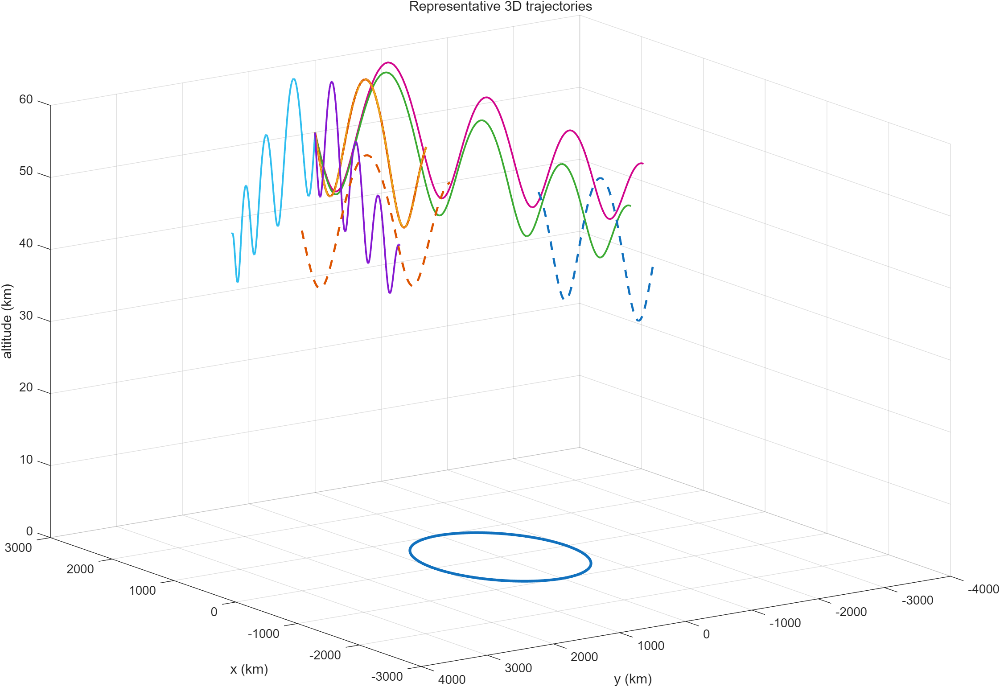
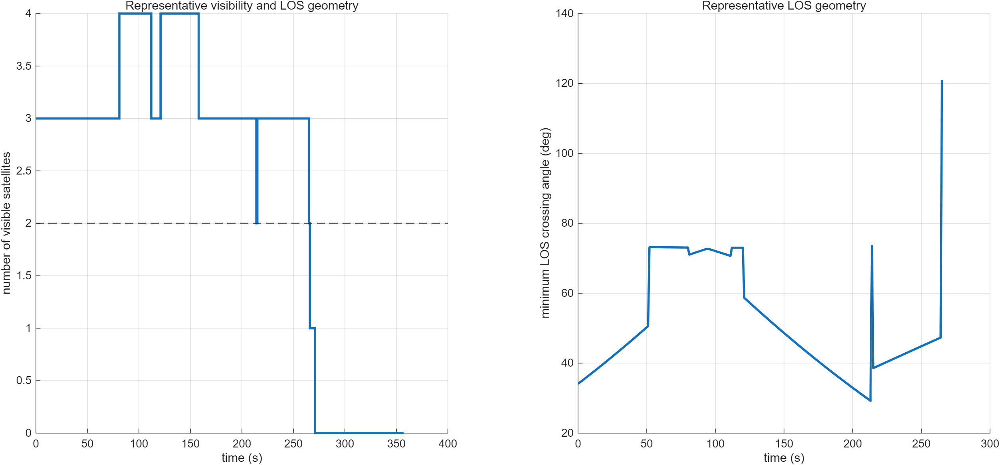
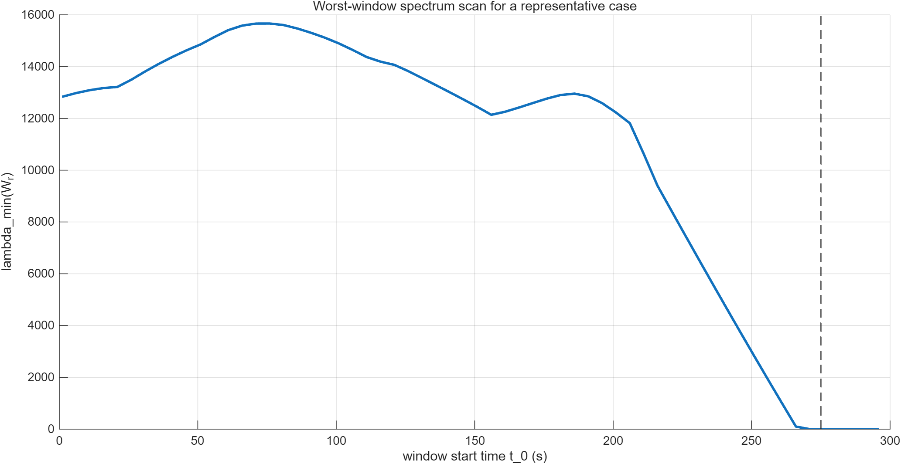
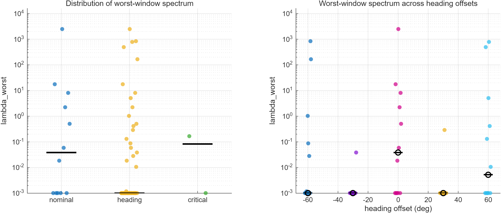
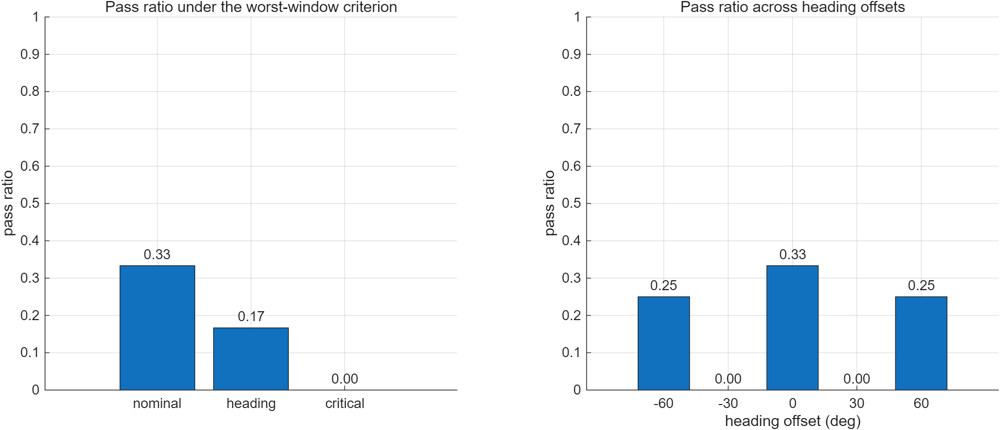

# Milestone M1：第四章基线实验包

## 目标

本里程碑用于固化第四章前半部分的基线实验结果，覆盖以下阶段：

- Stage01：保护圆盘与进入边界场景设计
- Stage02：HGV 轨迹样本库构建
- Stage03：单层 Walker 观测基线
- Stage04：最坏窗口谱退化与门槛化

本里程碑的目标不是继续开发算法，而是将已有结果整理为：

- 可复现实验导出物
- 可追踪的 milestone 结果包
- 可直接迁移进入论文第四章的图、表、文字说明

---

## 输入来源

本里程碑默认读取各阶段最新 cache：

- Stage01 cache: `results/cache/stage01_scenario_disk_*.mat`
- Stage02 cache: `results/cache/stage02_hgv_nominal_*.mat`
- Stage03 cache: `results/cache/stage03_visibility_pipeline_*.mat`
- Stage04 cache: `results/cache/stage04_window_worstcase_*.mat`

---

## 导出目录

导出物输出到：

- `deliverables/milestone_m1/figs/`
- `deliverables/milestone_m1/tables/`
- `deliverables/milestone_m1/notes/`

---

## M1.1 场景与轨迹基线

### 图

### 表

- `tab_m1_1_case_design.csv`
- `tab_m1_1_traj_family_summary.csv`
- `tab_m1_1_traj_heading_summary.csv`
- `tab_m1_1_traj_critical_summary.csv`
- `tab_m1_1_parameter_summary.csv`

### 说明

本部分用于固化第四章实验对象定义，包括：

- 保护圆盘与进入边界的抽象场景设定
- nominal / heading / critical 轨迹族的定义
- 开放环 HGV 轨迹模板的代表性说明

建议在论文正文中承接以下内容：

1. 说明保护区抽象为圆盘防护区域；
2. 说明进入边界用于定义外层来袭样本；
3. 说明 nominal、heading 扩展、critical 危险几何三类轨迹族；
4. 用 2D 和 3D 图辅助解释轨迹几何差异。

---

## M1.2 单层 Walker 观测基线

### 图

### 表

- `tab_m1_2_walker_baseline.csv`
- `tab_m1_2_visibility_case_summary.csv`

### 说明

本部分用于固化单层 Walker 基线参数与观测层结果，包括：

- Walker 基线参数 \(h,i,P,T,F\)
- 量程与 off-nadir 等可见性约束
- 单 case 可见性时间历程
- nominal / heading / critical 在覆盖率与 LOS 几何上的差异

建议在论文正文中承接以下内容：

1. 给出单层 Walker 基线设定；
2. 说明目标—星座观测几何建模；
3. 强调覆盖存在不等于几何稳定；
4. 为后续最坏窗口分析埋下铺垫。

---

## M1.3 最坏窗口谱退化与门槛化

### 图

### 表

#### Spectrum summaries
- `tab_m1_3_family_summary.csv`
- `tab_m1_3_heading_summary.csv`
- `tab_m1_3_critical_summary.csv`

#### Margin summaries
- `tab_m1_3_margin_family.csv`
- `tab_m1_3_margin_heading.csv`
- `tab_m1_3_margin_critical.csv`

### 说明

本部分用于固化最坏窗口谱分析结果，包括：

- 窗口信息矩阵 \(W_r(t_0,T_w)\)
- 最坏窗口谱底 \(\lambda_{\min}^{\mathrm{worst}}\)
- 门槛化指标 \(D_G = \lambda_{\min}^{\mathrm{worst}} / \gamma_{\mathrm{req}}\)
- nominal / heading / critical 的 pass/fail 统计

建议在论文正文中强调：

1. 最坏窗口指标比平均覆盖指标更能揭示局部失稳；
2. nominal 并不代表全局稳健；
3. heading 扩展显著降低通过率；
4. critical 场景在当前单层基线下全部失败。

---

## M1.4 阶段性结论

基于当前 Stage01–Stage04.2 的结果，可以得到以下阶段性结论：

1. 单层 Walker 基线对进入场景具有显著敏感性；
2. nominal 场景只能部分通过门槛，不具备全局稳健性；
3. heading 扩展会显著降低最坏窗口门槛通过率；
4. critical 场景在当前门槛下全部失败；
5. 因此，第四章后续有必要进入参数切片扫描与反演设计。

---

## 下一步

建议进入：

- **Stage05A：\(h-i\) 切片扫描**

目标是回答：

- 是否存在更稳健的单层 Walker 参数区间；
- 单层是否能通过参数调整补救；
- 或是否必须引入双层 / 几何补强。

---

## Git 跟踪建议

建议纳入 git：

- `milestones/milestone_m1_export_baseline.m`
- `milestones/milestone_m1_export_baseline.md`
- `deliverables/milestone_m1/tables/*.csv`
- `deliverables/milestone_m1/notes/*.md`
- 关键图 `deliverables/milestone_m1/figs/*.png`

建议忽略：

- `results/cache/`
- `results/logs/`
- `results/figs/` 中的中间开发结果